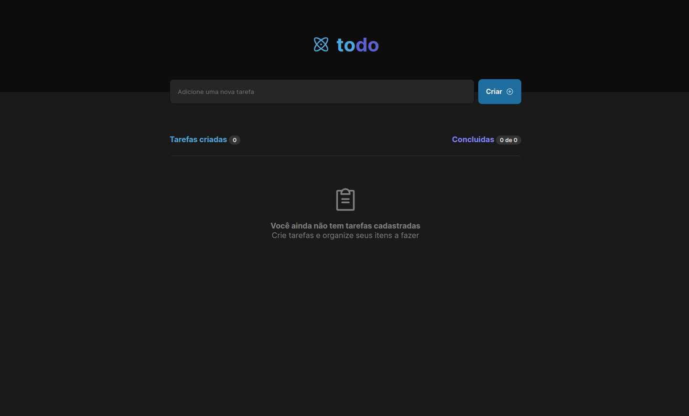
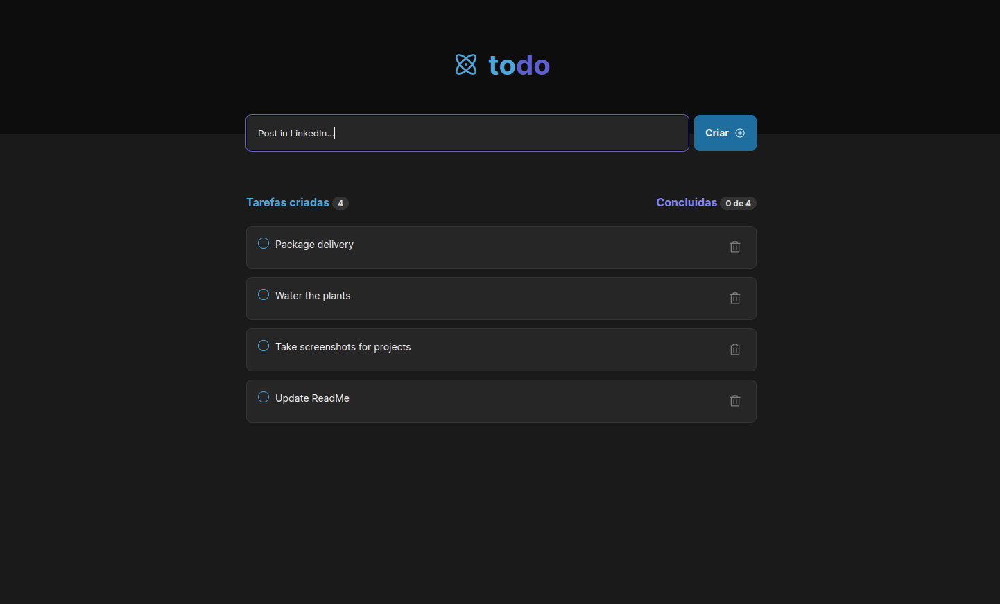
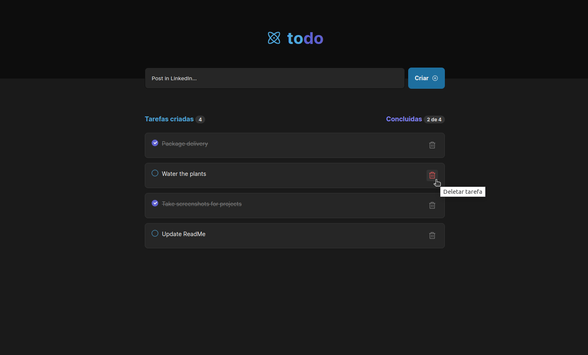

# Projeto Controle de Tarefas (To-Do List)

### 🚀 Projeto Desenvolvido com **React**, **Vite** e **TypeScript**.

O desafio era desenvolver uma aplicação de controle de tarefas estilo **to-do list** com as seguintes funcionalidades:

- [x] Adicionar uma nova tarefa
- [x] Marcar e desmarcar uma tarefa como concluída
- [x] Remover uma tarefa da listagem
- [x] Mostrar o progresso de conclusão das tarefas

## 🖥️ Pré-requisitos e como rodar a aplicação/testes

Antes de começar, você vai precisar ter instalado em sua máquina as seguintes ferramentas:
[Git](https://git-scm.com)

### 📋 Instruções

- Clone esse repositório `git clone`
- Instale as dependências, `npm install`
- No terminal, digite o comando `npm run dev`

## 🤖 Tecnologias Utilizadas

## 🖼️ Demonstração da aplicação

## 🚧 Status do projeto

Concluído

#### Visualização do site:
[Deploy na Vercel](https://to-do-seven-roan.vercel.app/)

## 🧑🏻‍ Autor

Feito por Felipe Soares

